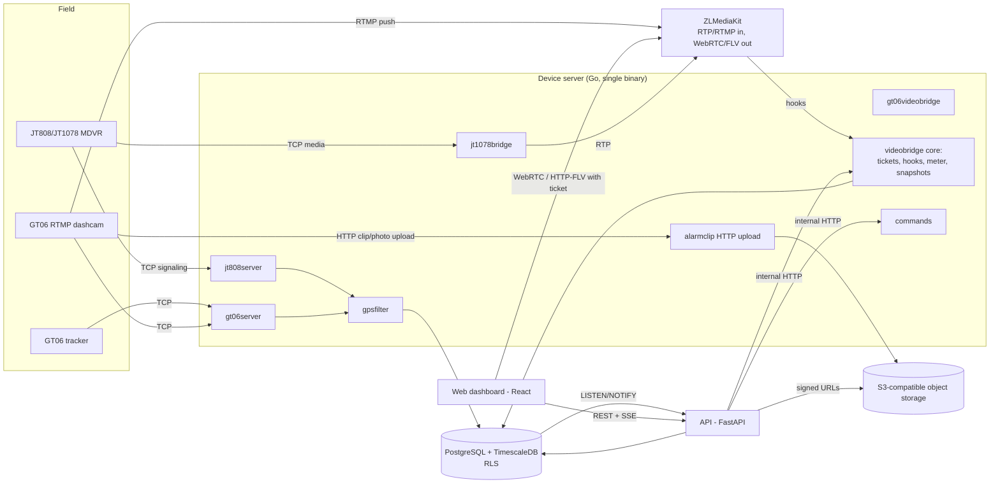

# OpenMDVR architecture

This document describes how OpenMDVR is built and why. It is the living
reference for the project: when an architectural decision changes, update
this file in the same change that motivates it.

Component-level detail (exact endpoints, test inventories, edge cases) lives
in `api/README.md`, `jt808-server/README.md` and `web/README.md`. The threat
model and security controls are summarized in
[security-model.md](security-model.md); device protocol coverage is in
[protocols.md](protocols.md).

## 1. Overview

OpenMDVR is a multi-tenant platform for fleet video and telematics. Fleet
operators (delivery, freight, taxis, service vehicles) connect MDVRs,
dashcams and GPS trackers, and get:

- live video (with audio) from one or several cameras per vehicle;
- real-time GPS on a map, route history, geofences and reports;
- alarms (SOS, power cut, overspeed, ignition, camera events) with
  notifications, webhooks and automatically retrieved video clips;
- remote commands (engine stop/resume, device configuration) with a full
  audit trail.

Devices are commodity hardware from many vendors, speaking open or de facto
standard protocols: **JT/T 808-2019** with the **JT/T 1078-2016** video
extension, and the **GT06/Concox** family (including RTMP-push dashcams that
use GT06 for signaling). No vendor cloud is required as a server.

## 2. Design principles

**Low cost per camera.** The platform is designed so that infrastructure cost
per connected camera is cents, not dollars, per month. When a simple and cheap
option competes with an "enterprise" one, the simple option wins unless there
is a real, stated trade-off. This principle explains most decisions below:
no message broker, no Kubernetes, live video only on demand, quotas enforced
server-side, metering of every byte served.

**Modular monolith.** One Go binary handles every device protocol, one
FastAPI process serves the business API, one PostgreSQL database holds
everything. Modules have explicit interfaces (protocol plugins, storage,
payment provider) so they can be split later if real volume justifies it,
but nothing is distributed today without a reason.

**Security below the application.** Tenant isolation is enforced by
PostgreSQL Row Level Security, not only by application code. Untrusted
network input (thousands of field devices) is handled with bounded,
crash-proof parsers. Video access is authorized inside the media server.

**Protocol-agnostic contracts.** Each subsystem exposes one narrow entry
point that every protocol uses: a single database path for positions, one
for alarms, one interface for video, one for commands. A new device family
implements a decoder and inherits geofences, speed limits, metering, quotas,
notifications and the UI.

**Measure, don't guess.** Every byte served to a client is recorded in
`usage_events`. Pricing, quotas and scaling decisions are based on real data.

## 3. Components



| Component | Technology | Why |
|---|---|---|
| Device server | Go | Thousands of long-lived TCP connections are what goroutines are built for; low memory per connection; strong typing helps when parsing binary protocols. |
| Media server | ZLMediaKit | Ingests RTP/RTMP and serves WebRTC and HTTP-FLV to browsers. Built from a pinned upstream commit plus an audio transcoding patch (section 6.6). |
| Business API | FastAPI (Python) | CRUD, reports, billing and auth logic without the concurrency pressure of device traffic. |
| Database | PostgreSQL + TimescaleDB | Hypertables for time series (`gps_positions`, `alarms`, `usage_events`), RLS for isolation, background jobs for retention and billing. |
| Object storage | Any S3-compatible service | Alarm video clips, behind a storage abstraction. A zero-egress provider is recommended because clips are viewed repeatedly. |
| Dashboard | React + Vite + Tailwind | Map-first monitoring UI, multi-camera live view, administration, reports, billing. Mobile-first. |
| Deployment | Docker Compose | One `infra/docker-compose.yml` runs the whole stack; any reverse proxy with automatic TLS can front it. |

### Repository layout

```
/jt808-server   Go device server: JT808, JT1078 bridge, GT06, RTMP video, commands, clips
/api            FastAPI business API
/web            React dashboard
/infra          docker-compose, PostgreSQL migrations and RLS tests, ZLMediaKit image/config
/loadtest       load-test tooling
/docs           this documentation
```

## 4. Multi-tenancy: shared schema + Row Level Security

### 4.1 Model

There are no per-tenant databases or schemas. Every business table carries a
`tenant_id`, and RLS is `ENABLE`d and `FORCE`d on all of them, with separate
policies per command (SELECT/INSERT/UPDATE/DELETE) rather than one `FOR ALL`
policy, because `DELETE` has no `WITH CHECK` clause.

The rule for API code is: let RLS filter; never rely on a hand-written
`WHERE tenant_id = ...` as the only barrier. A buggy query returns nothing
from another tenant instead of leaking it.

### 4.2 Roles

| Role | Scope | Notes |
|---|---|---|
| `super_admin` | Platform (`tenant_id` NULL) | Full access; creates tenants, platform users, billing plans; sends device configuration commands. |
| `support` | Platform (`tenant_id` NULL) | Cross-tenant read and operational support. Shares RLS bypass with `super_admin`, but the API denies it product-level writes (creating tenants or platform accounts, billing plans, API keys, configuration commands). |
| `tenant_admin` | One tenant | Manages users, vehicles, drivers, routes, geofences, branding and policy of its tenant. |
| `tenant_operator` | One tenant | Live video, playback, alarms; no administration. |
| `tenant_viewer` | One tenant | Read-only. |
| `driver` | One tenant + one driver | Only shift events and assigned routes. |

Platform users have `tenant_id = NULL` and an explicit `is_platform_bypass`
flag, held consistent by a `CHECK` constraint. Bypass is never implicit.

The distinction between `super_admin` and `support` is not expressible in RLS
(both bypass); it lives in API dependencies (`require_super_admin`,
`require_bypass`, `require_tenant_admin`, `require_non_driver`). Allowlist
dependencies (require a specific role) are preferred over blocklists: a
blocklist dependency once let a newly added `driver` role inherit fleet-wide
read access because nobody remembered to exclude it.

### 4.3 Per-transaction GUCs

At the start of every transaction the API sets, with parameterized
`set_config(..., true)` (transaction scope, bound parameters, never string
concatenation):

- `app.tenant_id`, `app.bypass_rls`, `app.user_id`, `app.role`;
- `app.driver_id` for driver accounts;
- `app.api_key_device_filter` for scoped API keys.

Helper functions (`app_current_tenant_id()`, `app_bypass_rls()`,
`app_current_driver_id()`, `app_is_tenant_admin()`) read them. Missing
values fail closed. Pooled connections are safe because the settings are
transaction-scoped.

Device visibility inside a tenant (per-user and per-group device assignments,
scoped API keys) is centralized in one predicate, `app_can_view_device()`,
used by the policies and views of devices, positions, alarms, commands,
video clips and geofence data. New device-scoped resources reuse it instead
of re-implementing it.

### 4.4 TimescaleDB hypertables: views and SECURITY DEFINER

TimescaleDB propagates `GRANT`s from a hypertable to its physical chunks, but
`FORCE ROW LEVEL SECURITY` cannot be applied to a chunk. A role with a direct
grant on a hypertable can therefore read and write its chunks by name
(`_timescaledb_internal.*`) without passing through any policy.

For that reason **no hypertable has a direct grant to the application role**:

- reads go through `security_barrier` views (`gps_positions_v`, `alarms_v`,
  `usage_events_v`) that apply the tenant and device predicates;
- writes go through `SECURITY DEFINER` functions (`insert_gps_position()`,
  `insert_alarm()`, `insert_usage_event()`, `record_device_data_usage()`)
  that validate tenant ownership themselves.

This rule applies to any future time-series table.

A second consequence: TimescaleDB refuses native compression on tables with
row security. Disabling RLS to compress would reopen the isolation gap, so
compression is deliberately off; retention policies bound growth instead
(section 13).

### 4.5 Other integrity decisions

- Foreign keys from hypertables to `devices`/`users` are `ON DELETE
  RESTRICT`. Referential actions run with the table owner's privileges and
  ignore RLS, so a `CASCADE` would let a tenant silently destroy protected
  history. Devices and users are retired by status (`inactive`/`disabled`),
  not deleted.
- Creating a device is a platform action (bypass only). This also prevents a
  tenant from using the global uniqueness of device identifiers as an
  existence oracle for other tenants' devices.
- Object storage keys for evidence must start with `tenants/<tenant_id>/`,
  enforced by a `CHECK` on `alarms.video_evidence_key`, so a tenant cannot
  point its own alarm at another tenant's video object.

### 4.6 Authentication and revocation

- JWT (HS256) with `tenant_id` and `role` (plus `driver_id` for drivers).
  Algorithm pinned; claims are validated (unknown role or malformed UUID
  returns 401, never 500).
- Login uses a dummy bcrypt hash for unknown emails (constant time), rejects
  passwords over 72 bytes, runs bcrypt in a thread pool so login bursts do
  not stall the event loop, and returns one generic error message for every
  failure (no per-field hints).
- **Revocation is real.** A JWT lives up to 8 hours, but every authenticated
  request re-checks `users.status` and `tenants.status` (inside `get_db`, so
  it covers nearly every endpoint automatically, plus the SSE ticket and the
  SSE loop itself). A disabled account gets 401; a suspended or cancelled
  tenant gets 402. The cost is one indexed query per request, accepted on
  purpose.

Isolation is tested in `infra/postgres/tests` against a real PostgreSQL with
at least two tenants that must not see each other (IDOR, cross-tenant
writes, pooled-connection hygiene, SQL injection through GUCs, direct chunk
access, referential integrity, column scope of sensitive updates).

## 5. Device ingestion

All device listeners run in the Go binary and receive untrusted internet
traffic. Each follows the same hardening checklist:

- `recover()` per unit of work (per connection, and per message where
  parsing is complex) so one malformed packet cannot crash the process;
- reassembly buffer limits checked on the **remainder** after extracting
  complete frames (checking the total just read once dropped legitimate
  video traffic);
- maximum concurrent connections per listener and idle timeouts;
- never leave a device without an answer on internal errors (prevents
  infinite retry storms);
- only provisioned identifiers are accepted;
- database access as the application role with `app.bypass_rls` per
  transaction (the tenant is only known after resolving the device), writing
  exclusively through `SECURITY DEFINER` functions.

### 5.1 JT808

The low-level codec (framing, escaping, checksum, message structs) comes from
`go-jt808/protocol` (MIT), adopted after an audit: license, activity, grep of
network/exec/unsafe calls, and `govulncheck`, repeated on version bumps
(procedure in `jt808-server/README.md`). Tenant resolution, device
authentication and database writes are project code: that is the trust
boundary and is not delegated.

A terminal is identified by its BCD `jt808_terminal_id`. The decoder strips
leading zeros, so a `CHECK` on `devices` forbids provisioning identifiers
with leading zeros. The JT808 authentication code is issued for protocol
compatibility only; it is not the security mechanism.

Location reports (0x0200) provide position, speed, heading, the ACC and
status bits (ignition and fuel/power relay), the GPS fix bit and the standard
alarm bits (including basic ADAS/DSM flags). Positions without a fix are not
stored.

### 5.2 GT06 family

The GT06 listener (`gt06server`) has its own connection registry, separate
from JT808's, to keep the blast radius of each protocol small. CRC-16/X-25 is
implemented in-house and verified against the standard check value.

The ecosystem is fragmented by vendor, and the implementation handles the
variants observed on real hardware:

- position/alarm messages under both numberings (0x22/0x26 and the classic
  0x12/0x16), with replies echoing the number the device used;
- command replies on 0x15 and the vendor 0x21 layout, parsed by locating the
  first printable ASCII run instead of a fixed offset;
- camera event reports (0x95), a comma-separated list of recorded file names,
  turned into one `camera_event` alarm per event (two cameras = one alarm);
- terminal information (ignition and relay state) read from both alarm
  frames and heartbeats, because some devices only report it in heartbeats.

Device timestamps are untrusted. A forged year once created dozens of
hypertable chunks and a permanent "future last position". Timestamps outside
`[2020, now + 24h]` are replaced with the server receive time; the
coordinates are kept, so a device with an unsynchronized clock still shows
up on the map without letting it control stored time.

GT06 has no cryptographic device authentication; anyone who knows an IMEI
can impersonate that tracker. Mitigations are provisioning, timestamp and
quality checks, and visibility, not cryptography.

### 5.3 GPS quality filter

Receivers drift: a parked vehicle can report several km/h and jump tens of
meters, producing fake distance, fake geofence exits, overspeed alarms and an
"idling" status. `internal/gpsfilter` sits on the single path every protocol
uses to store positions (the filtered position insert in `internal/db`):

- a per-device state machine (parked / moving) with an **anchor** and an
  **adaptive uncertainty radius** derived from satellite count and the
  observed dispersion of that device (EWMA, capped);
- readings inside the radius are stored at the anchor with speed 0;
- leaving "parked" requires accumulated evidence: consistent movement away
  from the anchor, high Doppler speed or a large distance; with ignition off
  more evidence is needed but movement is still accepted (towing, theft);
- entering "parked" is decided by real displacement over a time window, not
  by reported speed;
- incoherent jumps (impossible implied speed, or contradicting the reported
  speed) are held; if the next reading continues from the new place both are
  kept (tunnel exit), if it returns it was a bounce and is dropped;
- thresholds scale with each device's learned reporting interval, so the
  filter behaves the same at 1 s and at 300 s;
- **nothing real is lost**: every corrected reading keeps the original in
  `gps_positions.raw` together with the reason and the parameters used;
- after a restart the filter seeds each device's state from its last stored
  position, so in-memory state loss does not produce fake movement.

Known limitation: history stored before the filter existed is not
reprocessed.

### 5.3.1 Commit mode for positions

`insert_gps_position()` sends a `pg_notify` for the live map, and PostgreSQL
serializes the commit of every notifying transaction behind one
database-wide lock held across the WAL flush. With synchronous commits this
capped ingestion for the whole platform at one commit per `fsync` (about 550
positions per second on a slow disk in our load test). Transactions that
store positions therefore commit with `synchronous_commit = off`, scoped to
the transaction; any transaction that also inserts an alarm is forced back to
a durable commit, and every other write in the system stays durable. If
PostgreSQL itself crashes, roughly the last 0.6 s of positions can be lost;
the database is never corrupted. Measurements in
[scalability.md](scalability.md).

### 5.4 Data usage per SIM

Each accepted connection is wrapped in a byte-counting `net.Conn`
(`internal/datausage`), shared by all listeners. Counts are flushed
periodically and on close into `device_data_usage_monthly` (a plain table,
not a hypertable: only monthly sums are needed) through
`record_device_data_usage()`. The platform can compare consumption with the
SIM plan's data cap and cost; those plan fields are visible only to platform
roles.

## 6. Video

### 6.1 ZLMediaKit and the JT1078 bridge

The open-source edition of ZLMediaKit does not understand JT1078 (that is a
feature of its commercial edition). Pointing the device's video directly at a
raw RTP port is not viable: JT1078 is not bit-compatible with RTP.
`internal/jt1078bridge` therefore performs the real translation: it receives
JT1078 on its own port, reassembles frame fragments, splits H.264 NAL units
and packetizes them as standard RTP, delivered to ZLMediaKit through its RTP
ingestion API (`openRtpServer`).

RTP never carries an oversized NAL unit in one packet just because the
transport is TCP: I-frames can exceed 70 KB and are fragmented with FU-A
(RFC 6184 section 5.8); receivers reject abnormally large packets regardless
of transport.

Signaling: the bridge sends JT808 0x9101/0x9102 over the device's existing
signaling connection. `RequestVideo()` is idempotent through a registry of
active streams, which fixed a real race where a second viewer joining a live
stream made `on_stream_not_found` reopen the RTP receiver and drop the device.

### 6.2 RTMP dashcams over GT06

Some dashcams (for example Jimi JC261/JC400) use GT06 for telemetry and push
live video by RTMP directly to the media server. The platform starts and
stops video with GT06 text commands on the already-authenticated connection
(`RTMP,ON,INOUT#` / `RTMP,OFF#`), reusing the command correlation machinery
of section 9. One start command lights up both cameras (front and cabin);
stream names are `<channel>/<imei>`, matched by an anchored pattern so that
no alias stream can be created for the same IMEI. Per-channel waiters, an
in-flight marker per device and a shared request budget prevent duplicate
start commands from occupying the device's single command slot.

### 6.3 Protocol-agnostic video core

ZLMediaKit accepts only one URL per hook type, so a shared dispatcher is
unavoidable. `internal/videobridge` is the protocol-agnostic core:

- `Protocol` interface: `Name`, `App`, `ParseStream`, `StreamName`,
  `LookupDevice`, `AuthorizePublish`, `HandleStreamNotFound`,
  `HandleStreamStopped`, `HandleIdleStream`, `IsPublishing`,
  `LiveViewClaimed`, plus the optional `NativeSnapshotter`;
- `Dispatcher` routes every hook by `app`/protocol name and refuses to
  register a protocol with an empty name or app;
- shared by reference across protocols: the ticket store, the ZLMediaKit
  client, the active-stream registry (protocol state is an opaque payload
  only its owner interprets), tenant video limits and the live meter.

`jt1078bridge` and `gt06videobridge` each implement `Protocol` and own only
their signaling endpoint. Adding a camera family means a new package that
implements the interface and one registration line in `cmd/server/main.go`.

### 6.4 One-time play tickets and hook authorization

- The browser never receives a guessable stream URL. `POST
  /devices/{id}/video` (API) checks ownership through RLS, asks the bridge to
  start the stream and mints a **one-time ticket** bound to tenant, device,
  channel and app (TTL 90 s).
- `on_play` validates the ticket before a single byte is served; a reused,
  expired or mismatched ticket is rejected and the camera is not turned on.
  Binding the ticket to the app prevents numeric identifier collisions
  between JT808 and GT06 namespaces from authorizing another tenant's stream.
- `on_publish` authorizes every push. The internal RTP app used by the
  JT1078 bridge is reachable only from the internal network; external RTMP
  publishes must match a provisioned camera device (`gt06_video`) of an
  active tenant. GPS-only trackers cannot publish.
- HLS and directory listing are disabled: static segments would bypass
  `on_play`.
- `on_stream_none_reader` stops a stream after a grace period without
  viewers, checking whether a sibling channel of the same device is still
  watched.
- The bridge's internal HTTP API has no authentication of its own and must
  never be exposed outside the internal network. Tickets travel in the query
  string, so ZLMediaKit API debug logging must be off in production.

### 6.5 Snapshots before live video

Live video is the most expensive thing the platform serves, so camera tiles
show a recent still photo first, refreshed only while visible and at most a
few times per view.

- Devices with a native photo command implement `NativeSnapshotter` (GT06
  dashcams: `Picture,out#` / `Picture,in#` / `Picture,inout#`). The device
  uploads the JPEG to the same HTTP upload endpoint used for clips; requests
  for both cameras are batched into one command, `busy` replies are retried
  with backoff, and late photos measured against the camera's own clock are
  still accepted into the cache.
- Otherwise the core starts the stream for a few seconds, grabs one frame
  with ZLMediaKit `getSnap` using its own one-time ticket, and stops the
  stream immediately unless a real viewer claimed it. `getSnap` returns HTTP
  200 with a placeholder image when it fails; the content type distinguishes
  a real frame.
- A shared in-memory cache (per device and channel, 60 s TTL) means several
  viewers of the same camera trigger one capture. The API checks the cache
  before starting any signaling.

### 6.6 WebRTC playback with audio

Browsers play live video over WebRTC (HTTP-FLV via mpegts.js remains as a
fallback). Dashcams send AAC audio, which WebRTC does not accept. The
upstream image does not link FFmpeg, and AAC/Opus transcoding lives in an
upstream feature branch, so `infra/zlmediakit/Dockerfile` builds a pinned
upstream commit plus `audio-transcode.patch` derived from that branch. The
build fails if `MediaServer` is not linked against libavcodec.

Transcoding runs only while a WebRTC viewer is attached, so idle cameras cost
no CPU. The same code converts Opus to AAC for audio published by a browser,
which is the server side of two-way audio; the device-side command for
talk-back is not yet known for supported dashcams. To upgrade ZLMediaKit,
regenerate the patch on the new commit and repeat the verification.

## 7. Live position push

Devices already push positions over persistent TCP; the gap was between the
server and the browser.

- **Signal: PostgreSQL `LISTEN/NOTIFY`**, not Redis or a queue.
  `insert_gps_position()` calls `pg_notify('gps_positions', ...)`;
  notifications are delivered only on commit. A trigger on `devices` notifies
  `device_status` only when ignition or relay state actually changes (never
  on every heartbeat).
- **Transport: Server-Sent Events**, not WebSocket. The channel is one-way
  and SSE is a plain long HTTP response.
- **One listener per API process** with in-memory fan-out
  (`api/app/live_positions.py`), never one `LISTEN` per browser. Each replica
  forwards only to its own clients, so it scales horizontally.
- **This is an isolation boundary outside RLS.** `NOTIFY` has no permission
  model; every listener receives every tenant's events. Filtering by tenant
  and visible devices happens in the broadcaster, at the source.
- **Authentication by one-time ticket.** `EventSource` cannot send an
  `Authorization` header and the JWT must not appear in a URL. `POST
  /positions/stream/ticket` returns an opaque single-use token valid 30 s;
  the stream re-checks role and account status periodically.
- **Resilience.** The listener reconnects with its own exponential backoff;
  a malformed notification is dropped without killing the listener. The
  browser implements its own reconnect loop (the native one would reuse a
  spent ticket), reseeds from `GET /positions/latest` on every reconnect and
  reconciles every 90 s as a safety net. The active `EventSource` is closed
  explicitly on logout. `GET /health` reports `listener_connected`.

`GET /positions/latest` uses a `LATERAL ... LIMIT 1` per visible device over
a `(device_id, time DESC)` index instead of `DISTINCT ON` across the whole
retention window.

## 8. Usage metering and quotas

### 8.1 `usage_events`

Every place that serves bytes to a client (live view, playback, download)
records a row in `usage_events` (tenant, device, type, bytes, timestamp,
metadata). It is not optional.

The API never sees video bytes (the browser plays directly from ZLMediaKit),
so "requesting video" is the wrong place to meter. Instead ZLMediaKit's
`on_flow_report` reports the real bytes and duration of each player
connection; reports from the bridge's own ingest (`player=false`) are ignored
because ingest is not billable. `general.flowThreshold` is 0: with the
default 1 MB threshold, short views never produced a report and never
consumed quota. `user_id` is NULL in these rows (no JWT context reaches the
hook); attribution is per tenant and device. Native photos are recorded as
`download` events with their real size.

### 8.2 Live-view limits

Two server-side limits per tenant, never UI-only warnings:

- `max_live_view_seconds`: maximum length of one viewing;
- `live_view_monthly_quota_seconds`: a monthly balance (402 when exhausted).

`internal/videobridge/meter.go` (`LiveMeter`) is the central meter shared by
all protocols:

- only **billable** streams count (claimed by a viewer); streams started
  only for a snapshot, or a sibling channel the device turned on by itself,
  are not billed;
- each camera is metered separately (two cameras consume twice as fast);
- checkpoints are written to `usage_events` every 30 s, so the balance is at
  most 30 s stale and a crash loses at most one interval;
- remaining balance = quota - consumed in the database - not yet written;
- a loop checks only tenants with open streams every 2 s and cuts all of a
  tenant's streams when the quota runs out, adjusted so the error stays
  within about one second.

`GET /devices/{id}/live-view-balance` exposes the live balance and number of
open streams; the dashboard counts down locally between polls.

## 9. Remote commands

### 9.1 Engine stop/resume

Cutting fuel to a real vehicle is the most dangerous action in the system.

- **Layers.** The API, database and UI speak a protocol-agnostic vocabulary
  (`engine_stop`, `engine_resume`). `internal/commands` defines a `Sender`
  interface and an internal endpoint that resolves the protocol; only the
  protocol package translates to wire text. A new protocol implements
  `Sender` without touching the API, schema or UI.
- **Authorization.** `tenant_admin` or platform only. The UI requires typing
  the device label before "stop" is enabled.
- **Durable audit.** `device_commands` stores who, when, what and the
  device's literal reply. The pending row is written in its own short
  transaction before the command is sent, and the result in another, so a
  later failure cannot erase the record that the attempt happened. A trigger
  forbids reopening a finished command and checks that the row's tenant
  matches the device's tenant. Replies are sanitized of control bytes.
- **Success means the device said so.** A reply frame only proves transport;
  devices can refuse (moving, no GPS fix) and still reply. Status is
  `success` only if the reply text confirms it.
- **Strict correlation.** There is no reliable correlation ID in GT06, and
  each connection has a single pending slot. A late reply must never confirm
  a different command (a late "stop" reply confirming "resume" would be the
  worst possible bug). A pending command is not cleared when its caller
  times out; it is consumed only by its own reply, or expires after a
  generous age. A new command may take over an abandoned slot only when both
  belong to families with identifiable reply keywords, never engine to
  engine, and replies whose keyword does not match the pending command are
  discarded.

Trade-off kept on purpose: a hung video command can delay an engine command
for up to the abandonment age. Shortening it would reopen the late-reply
risk.

### 9.2 Device configuration commands

`device_config_commands` is a separate, platform-only audit table. Commands
(server address, APN, upload URLs, timers, sensitivity, reboot, firmware
update, and others) are built server-side from a catalog with a validated
model per command; the client never sends raw text, so an injected `#`
cannot terminate a command and append another. Sending requires
`super_admin`; viewing history requires any platform role. Commands that can
disconnect a device from the platform (server address, APN, RTMP target,
firmware) require typing the device label, and firmware URLs are restricted
to the vendor's distribution domain over HTTPS. No third-party host is ever a
default value. Commands not yet confirmed against real hardware are labeled
as such in the catalog.

## 10. Alarms, notifications and webhooks

### 10.1 Alarms

All alarms go through `insert_alarm()`. Some are raised by device protocols;
others are derived inside the database so every protocol gets them:

- ignition on/off and relay changes, from a trigger on `devices` that fires
  only on real transitions;
- overspeed against `vehicles.max_speed_kmh`, evaluated inside
  `insert_gps_position()` on the entry edge only (a per-device flag), in its
  own exception block so a failure never prevents storing the position;
- geofence events (section 12).

### 10.2 In-app notifications

`insert_alarm()` fans out to a per-user mailbox (`notifications`) for the
tenant admins of the device's tenant and users assigned to the device or its
groups, and publishes on a `notifications` channel consumed by the same
single-listener SSE pattern. Platform accounts do not receive tenant mailbox
notifications by design.

### 10.3 Outbound webhooks

Webhooks are enabled per tenant by a `super_admin` and then managed by the
tenant admin.

- **Efficiency.** The dispatcher listens on the existing `notifications`
  channel and runs one indexed query per event ("does this tenant have the
  feature and a subscribed endpoint?"); the common case does no HTTP at all.
  A separate worker delivers using `FOR UPDATE SKIP LOCKED` with leases,
  exponential backoff (1 minute to 24 hours) and a circuit breaker after 10
  consecutive failures, enforced by a trigger.
- **Idempotency.** A `dedupe_key` with a unique index per endpoint and `ON
  CONFLICT DO NOTHING` makes deliveries exactly-once even when several
  processes listen to the same channel.
- **Signing.** HMAC-SHA256 over timestamp and body, with a per-endpoint
  secret. Payloads use a per-alarm-type allowlist, never a passthrough of
  internal details.
- **SSRF protection.** Destinations are validated against private, loopback,
  link-local and reserved ranges at creation, on edit and at delivery. DNS is
  resolved once, validated, and the connection is pinned to that IP with the
  original Host and SNI (TLS still verifies the domain), which defeats DNS
  rebinding. Redirects are not followed; the error tells the user which URL
  to use instead.
- **Limits.** A cap on endpoints per tenant, delivery stops for inactive or
  unapproved tenants, and a signed test ping endpoint for diagnostics.

## 11. Alarm video clips and storage

### 11.1 Storage abstraction

Business code never calls a provider SDK directly. The Go side uploads
through `internal/storage` (`Client.Upload`, S3 API, explicit
`Content-Length` because some S3-compatible providers reject streaming
uploads without it); the Python side only signs short-lived read URLs
(`api/app/storage.py`). Changing provider is a matter of endpoint and
credentials. Keys are prefixed with `tenants/<tenant_id>/`. Lifecycle rules
on the bucket handle expiry, and the bucket needs a CORS policy allowing GET
from the dashboard origin because clips are played directly by the browser.

### 11.2 Clip retrieval

Dashcams record event clips (one-minute MPEG-TS segments) on their SD card
and upload them by HTTP multipart to a URL configured on the device.

- When a camera event (0x95) arrives, the server immediately requests the
  exact file the device reported (`UPLOADFILE,<name>#`), front camera first
  and cabin chained after the front upload completes (the device has one
  command slot). A manual "request clip" path exists for alarms that only
  have a timestamp, and is offered only for alarm types that actually have
  recorded video.
- `alarm_video_clips` audits each request; a trigger forbids changing the
  status of a finished request. Requests stuck in `requested`/`uploading` are
  marked failed lazily on read and by a periodic database job.
- The upload endpoint (`internal/alarmclip`) is public, so it requires an
  **authenticated GT06 connection alive for that IMEI** before reading the
  body, matches uploads by exact file name only against active requests, and
  has timeouts, a body size limit and a connection cap.
- **Evidence integrity.** The file name embeds the recording time. If it
  differs from the alarm time by more than a few minutes, the file is stored
  in quarantine instead of being attached, so video from another day is
  never presented as evidence of an incident. A file that arrives after its
  request timed out is recovered into the original request only if that
  request never had video.
- Unrequested uploads are acknowledged with 200 and discarded (an error makes
  devices retry forever and waste cellular data); repeated uploads are
  recorded in a deduplicated `device_health_events` table visible to
  platform operators.

## 12. Geofences

Geofence evaluation lives in the database, inside `insert_gps_position()`,
the only path every protocol uses. PostGIS is not required: circles use
haversine and polygons use ray casting over native coordinate arrays.

- Tables: `geofences` (configuration; writes require tenant admin in RLS as
  well), `geofence_devices` (optional scope), `geofence_device_state` (inside
  or outside, per device and geofence) and `geofence_events` (append-only
  report source with a snapshot of the geofence name). The application role
  cannot write state or events.
- Edge-triggered only, with exit hysteresis, a debounce, a guard against
  out-of-order and future positions, and **silent seeding** when a geofence
  is created, redrawn or enabled, so drawing one around a yard full of parked
  vehicles does not fire a burst of "entered" events.
- Enter, exit and dwell notifications are optional per geofence and reuse
  `insert_alarm()` (mailbox and webhooks for free).
- Cost limits, because the engine runs on the shared ingestion path: caps on
  geofences per tenant, vertices per polygon and total vertices, a cap on
  notifications per position, and evaluation over arrays copied to local
  variables. Iterating a large `jsonb` by index inside a PL/pgSQL loop
  decompresses it on every access; the first version took about a minute per
  position in the worst case, the array version takes tens of milliseconds.

## 13. Retention

Each time-series table has its own policy:

| Table | Policy | Reason |
|---|---|---|
| `gps_positions` | Per tenant, `tenants.gps_retention_days` (default 90) | The only high-volume table, and a plan attribute. Native retention drops whole chunks that mix tenants, so a custom `SECURITY DEFINER` procedure runs as a TimescaleDB background job. |
| `alarms` | Global, 365 days, native policy | Much lower volume; whole-chunk deletion is efficient. |
| `usage_events` | Never deleted | Billing ledger. |
| `api_key_usage_log` | 90 days | Audit log with bounded value. |
| Driver shift events/alerts | Not deleted | Low volume; labor-hours evidence. |

All jobs use TimescaleDB's built-in scheduler (`add_job()`); there is no
external cron.

## 14. Fleet model and reports

- `vehicles`, `drivers` and `driver_vehicle_assignments` (time-ranged, with
  partial unique indexes for "at most one active driver per vehicle and vice
  versa") separate the installed hardware from the vehicle and the person
  driving it.
- Drivers are `users` with role `driver` and a `driver_id`; RLS on
  `driver_shift_events` and `routes` adds a per-driver dimension through
  `app.driver_id`. Tenant shift policy (meal window, maximum shift hours)
  produces informational alerts; policy checks run in a savepoint so they
  can never block the real shift event.
- Reports (distance, engine hours, worked hours, geofence visits) are
  computed from positions and alarms over a maximum 31-day window and
  exported as CSV with spreadsheet formula injection neutralized. They are a
  data basis, not certified regulatory formats.
- Route history downsamples inside PostgreSQL with `time_bucket()` and
  `last()` to at most a requested number of points, regardless of raw volume;
  it is protected by a statement timeout and a per-user rate limit.

## 15. Billing

Billing is a module of the monolith, with internal invoices (not tax-certified
documents).

- `billing_plans`: a global catalog without `tenant_id`, priced per SKU and
  category (`gps`, `camera`, `addon`). SELECT is bypass-only; tenants learn
  plan names and prices only for lines they are subscribed to, through one
  narrow `SECURITY DEFINER` function whose only caller already filtered by
  RLS.
- `tenant_subscription_items`: what each tenant has contracted, with an
  optional price override; lines are ended, never deleted. Device quotas are
  derived from active lines per category (camera vs GPS), so provisioning a
  device beyond what was contracted fails with 409.
- `tenant_promotions`, `invoices` and `invoice_line_items`: a daily
  `generate_invoices()` job snapshots real prices (later catalog changes do
  not alter issued invoices). Each tenant is processed in its own exception
  block, so bad data for one tenant cannot roll back or block invoicing for
  everyone else.
- `payments` behind a `PaymentProvider` abstraction (manual payments today;
  card gateways can be added without touching the rest). Payment decides
  whether an invoice is paid and reactivates a suspended tenant in real time.
  A daily job marks overdue invoices and suspends tenants after a grace
  period; account revalidation (section 4.6) makes suspension effective
  immediately across the API, streams and video.
- Estimated cost and margin per tenant (`GET /billing/profitability`) use
  configurable cost assumptions and real usage; this is platform-only data,
  never reachable by a tenant.

## 16. API keys

API keys let other systems integrate without a human login. A key
authenticates **as an existing user** and can only narrow that user:

- `can_write` (read-only keys are enforced by HTTP method) and an optional
  `allowed_device_ids` list, enforced inside `app_can_view_device()` through
  a GUC, so every device-scoped resource inherits it. NULL means unscoped,
  an empty list means no devices; both are immutable (rotate = revoke and
  issue a new key);
- a router-tag allowlist in the single auth choke point: a new router is
  unreachable by API keys until explicitly added. Auth, billing, tenants,
  users, platform, engine commands, live video, device groups and SSE
  streams are never reachable;
- stored as HMAC-SHA256 with a dedicated pepper (distinct from the JWT
  secret), shown once at creation;
- per-key and per-IP rate limits, and an audit log written in a background
  task that includes rejected attempts;
- creation requires `tenant_admin` or `super_admin`, never `support`;
  revocation cannot be undone, enforced by a trigger.

Known limitation: device scoping does not restrict vehicles, drivers or
routes, which are not modeled per device for any role.

## 17. Dashboard

The dashboard is a React single-page app with code splitting per page.

- Map-first: full-screen map with floating panels on desktop and an in-flow
  layout on mobile (no `position: fixed` for primary navigation). Unified
  unit status (alarm, no signal, moving, idling, parked) used by the list,
  markers and summaries; stale telemetry is shown as stale, not as current.
- Base map: vector tiles by default through MapLibre GL under Leaflet,
  user-selectable styles, automatic fallback to raster providers when tiles
  fail, and a platform override for forcing a provider.
- Cameras: a dock below the content and optional floating windows that
  survive navigation; still photo first, live video only on click.
- Themes are CSS token sets; icons go through a single wrapper module so the
  icon library can be swapped in one place.
- The UI is currently in Spanish; i18n is on the roadmap.

## 18. Deployment

- `infra/docker-compose.yml` runs PostgreSQL, a one-shot migration runner,
  the device server, the API, the web app and ZLMediaKit. Migrations are
  numbered SQL files applied in order and tracked in `schema_migrations`;
  applied migrations are never edited.
- In development every port binds to `127.0.0.1`. In production,
  `PUBLIC_BIND_HOST` exposes only what must be public: device ports (JT808,
  JT1078, GT06, RTMP, clip upload), and the HTTP services behind a TLS
  reverse proxy. PostgreSQL and the bridge's internal API are never public;
  a cloud firewall should match.
- A single domain can serve the dashboard (`/`), the API (`/api`, prefix
  stripped) and media (`/media`, prefix stripped) through path routing, for
  example `https://portal.example.com`. Device traffic does not use HTTP and
  keeps connecting by IP and port (for example `203.0.113.10`).
- Secrets (JWT secret, API key pepper, database passwords, object storage
  credentials) come from environment variables, never from the repository.
- Admin panels (deployment tool, database, ZLMediaKit API) must never be
  exposed to the internet without strong authentication or a VPN.
- Scripts in containers must be committed with the executable bit; a host
  that ignores file modes can hide this until the first Linux deployment.
- ZLMediaKit does not reload `config.ini` on a redeploy that only changes the
  bind-mounted file; restart its container.

## 19. Known limitations

- No login rate limiting yet; bcrypt cost is the only brake.
- GT06 has no cryptographic device authentication.
- The RTMP port has no per-IP connection cap in ZLMediaKit; use a firewall
  or edge proxy.
- Device connection state is in memory: a restart of the device server drops
  connections until devices reconnect (some reconnect only every few
  minutes).
- The JT808 server does not yet bound device-reported timestamps the way GT06
  does (the geofence engine protects itself, but the position is stored).
- Vendor ADAS/DSM payloads, JT808 remote parameters, photo, media upload and
  recorded playback, CAN bus data and two-way audio are not implemented
  (see [protocols.md](protocols.md)).
- Map and live-view screens load the fleet roster with a pragmatic upper
  bound of 1000 devices; very large fleets need paginated rosters.
- No third-party penetration test has been performed yet.
